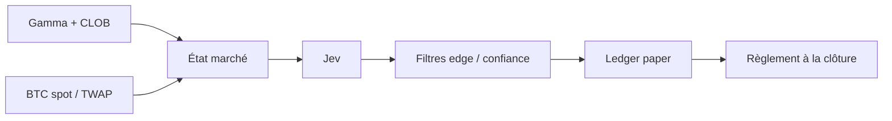

# Paper trading Polymarket BTC 5m + Jev

Bot de **paper trading** : il lit les marchés réels Polymarket `BTC Up or Down 5m`, demande à **Jev** (TypeSafe) une décision Up/Down calibrée, et simule les fills. **Aucun ordre réel n'est envoyé.**



## Ce que le bot fait

1. Calcule le slug de la fenêtre UTC en cours : `btc-updown-5m-{unix}`.
2. Charge l'événement Gamma, le `priceToBeat`, les token IDs Up/Down, le carnet CLOB.
3. Ajoute un spot BTC (Binance, sinon Coinbase) et, si possible, le TWAP Chainlink 60s via le websocket RTDS Polymarket.
4. Envoie cet état à Jev : choix `up`/`down` + proba + confiance, et un oui/non « est-ce tradable ? ».
5. N'entre que si confiance, edge vs l'ask (après frais taker crypto 7 %), spread et temps restant passent les seuils.
6. Simule un achat taker, débite un cash virtuel, puis règle à 1 $ / 0 $ quand Gamma publie le gagnant.

Le cash et les positions vivent dans `data/paper_state.json`. L'historique est dans `data/paper_ledger.jsonl`.

## Installation

```powershell
cd F:\ProjetPoly
python -m venv .venv
.\.venv\Scripts\Activate.ps1
pip install -r requirements.txt
copy .env.example .env
```

Crée une clé API Jev sur [TypeSafe](https://typesafe.ai), puis dans `.env` :

```
TYPESAFE_API_KEY=ts_...
DECISION_BACKEND=jev
```

Sans clé, tu peux déjà tester le câblage Polymarket :

```
DECISION_BACKEND=heuristic
```

## Commandes

```powershell
python -m polybot status     # marché 5m courant, sans Jev
python -m polybot once --trade
python -m polybot run        # 12 fenêtres 5m (~1 h), arrêt après résolution du dernier
python -m polybot run --tours 0   # boucle infinie
python -m polybot ledger     # cash, positions, derniers events
```

Pour réinitialiser le portefeuille paper : supprime `data/paper_state.json`.

## Filtres utiles

| Variable | Rôle |
| --- | --- |
| `PAPER_CASH` | Cash virtuel de départ (1000 $) |
| `STAKE_USD` | Mise cible par fenêtre |
| `MIN_CONFIDENCE` | Confiance Jev minimale |
| `MIN_EDGE` | `p_jev - ask - frais` minimum |
| `MIN_SECONDS_LEFT` | Ne pas entrer trop tard |
| `MAX_SECONDS_LEFT` | Ne pas entrer trop tôt (120 = seulement les 2 dernières minutes) |
| `POLYMARKET_SSL_VERIFY` | `false` seulement si un proxy casse les certificats |

## Réseau (important en France)

Depuis cette machine, `gamma-api.polymarket.com` et `clob.polymarket.com` peuvent être interceptés par l'ANJ (certificat `*.anj.fr` au lieu de Polymarket). Dans ce cas le bot ne peut pas lire les marchés.

```powershell
python -m polybot doctor
```

Si le diagnostic affiche `BLOCAGE TLS` / `anj.fr`, il faut un réseau, un VPN ou un proxy qui atteint vraiment Polymarket, puis éventuellement :

```
HTTPS_PROXY=http://127.0.0.1:PORT
```

Binance et TypeSafe peuvent rester joignables même quand Polymarket est bloqué.

## Limites

- Jev classifie l'état que tu lui donnes ; il ne « voit » pas le carnet tout seul.
- La résolution officielle utilise le TWAP Chainlink 60s, pas Binance. Le bot préfère le flux RTDS, avec le spot en repli.
- Les marchés 5 minutes sont durs : latency, frais, et un marché déjà efficient mangent souvent l'edge.
- Ce n'est pas un conseil financier. Laisse `run` en paper tant que le ledger n'est pas convaincant.
